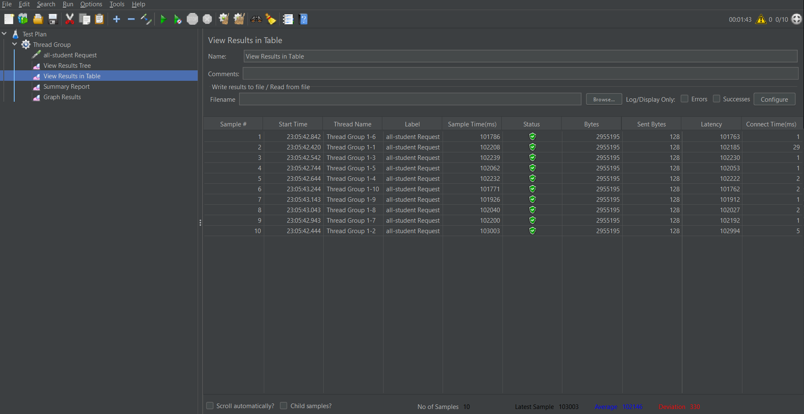

## Gilbert Kristian - Adpro A - 2306274951
---

# Module 5: Java Profiling
### JMeter Report & Test Results :

### Endpoint `/all-student`:
Test Result JMeter :

Before Optimization JMeter :

After Optimization JMeter : 

Test Result JMeter Post-Profiling:

### Endpoint `/all-student-name`:
Test Result JMeter :

Before Optimization JMeter :

After Optimization JMeter :

Test Result JMeter Post-Profiling:

### Endpoint `/highest-gpa`:
Test Result JMeter :

Before Optimization JMeter :

After Optimization JMeter :

Test Result JMeter Post-Profiling:

**Conclusion** : 

The results indicate an improvement in performance based on the recorded sample times. The execution time was reduced after optimization compared to the initial execution time. This suggests that the optimization process was effective, utilizing JMeter and IntelliJ Profiler for analysis.

---
## Reflection:

## 1. What is the difference between the approach of performance testing with JMeter and profiling with IntelliJ Profiler in the context of optimizing application performance?

- JMeter is used to measure application performance by simulating high workloads (mimicking multiple simultaneous users), essentially testing how the application performs under stress.
- IntelliJ Profiler is used to identify bottlenecks that cause poor or slow application performance, focusing on the internal workings of the code rather than simulating external conditions.

## 2. How does the profiling process help you in identifying and understanding the weak points in your application?

The profiling process is valuable for identifying application bottlenecks causing performance issues. During profiling:
- The profiler collects and analyzes data to identify bottleneck areas
- It provides key information such as CPU usage, memory allocation, garbage collection activity, and thread concurrency
- This data helps developers understand which specific parts of the application are causing performance problems

## 3. Do you think IntelliJ Profiler is effective in assisting you to analyze and identify bottlenecks in your application code?

According to the document, IntelliJ Profiler is considered effective in finding application bottlenecks due to features like:
- Flame graphs that visualize which parts of the code consume significant execution time
- Method List tab that provides execution time information
- Diff execution time metrics that show performance improvements after optimization without requiring manual calculations

## 4. What are the main challenges you face when conducting performance testing and profiling, and how do you overcome these challenges?

The main challenges mentioned include:
- Understanding profiling results: Properly interpreting profiling data to identify actual bottlenecks
- Implementing optimizations: Refactoring code to address identified bottlenecks effectively, which is considered a significant challenge

## 5. What are the main benefits you gain from using IntelliJ Profiler for profiling your application code?

Key benefits of using IntelliJ Profiler are:
- Integration with the IDE, eliminating the need for third-party applications
- Simplified setup process since profiling is built into the development environment
- Helpful visualizations like flame graphs
- Automatic calculation of performance improvements through diff execution time metrics

## 6. How do you handle situations where the results from profiling with IntelliJ Profiler are not entirely consistent with findings from performance testing using JMeter?

- Recheck JMeter configurations.
- Validate profiling metrics.
- Investigate external factors (e.g., hardware, network latency).
- Consult documentation and experts.

## 7. What strategies do you implement in optimizing application code after analyzing results from performance testing and profiling? How do you ensure the changes you make do not affect the application's functionality?

1. Reducing database calls:
    - Refactored `getAllStudentsWithCourses()` to retrieve all student-course relationships in a single database call
    - Used a HashMap to store student IDs, enabling efficient lookups during StudentCourse iteration

2. Improving data structures for memory allocation:
    - Optimized the `joinStudentNames()` method by replacing String concatenation (+=) with StringBuilder.
    - This reduces unnecessary memory allocation caused by String immutability.

3. Query optimization:
    - Improved the `findStudentWithHighestGpa()` method by replacing manual iteration with a direct SQL query.
    - Used `SELECT * FROM STUDENTS ORDER BY GPA DESC LIMIT 1` to retrieve the student with highest GPA.
